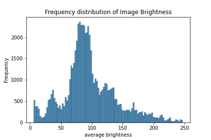

# Project overview
This project is for practicing 2D object detection in an urban environment. A dataset of images from Waymo is provided for this project. The target is to identify 3 classes of objects –cyclists, pedestrians, and vehicles, with a pre-trained deep learning algorithm.

The main purpose of object detection for self-driving vehicles (SDV) is to locate and classify objects in the vehicle's surrounding. This is a vital task for the safe operation of an SDV, allowing it to "see" other actors in its environment. Only if this is achieved, safe maneuvers can be planned and executed.

# Set up
I completed the project in the project workspace provided by Udacity. The workspace had all of the necessary libraries and data provided.

# Dataset
## Dataset Analysis
The implementation and original images for the exploratory analysis of our dataset can be found in the [Exploratory Data Analysis](https://github.com/jiangnan2341/UdacitySDCE_P1/blob/main/Exploratory%20Data%20Analysis.ipynb) notebook.

The class distribution in our dataset is highly imbalanced. There are a lot of vehicles, as opposed to lesser pedestrians and almost no bicycles. Model performance (average precision, recall etc.) should thus be monitored closely especially for the minority classes. In order to avoid poor performance of the object detection for the minority class, one could adopt multitude of strategies such as data augmentation for the underrepresented class.

The total occurence and proportion of the different object types is very heterogenuous across images. There are images with vehicles only (e.g. on a highway), while there are others with more pedestrians than vehicles (e.g. on a crossroad).

Light conditions vary heavily across the dataset, with sunny conditions (leading to bright images with high contrast) as well as rainy/foggy conditions (causing reflections and blurs in the images) alike. Also, there are recordings of night drives.
Image distortions can be observed as well, especially on the image edges.
In images with multiple objects, objects tend to be clustered and occlude each other.

The class distribution and the light condition distribution are illustrated in diagrams below:

## Cross-validation
The creation of training vs. validation split, which is usually performed based on the exploratory analysis, was already done in the workspace, with 87 : 10 TFRecords in the training and validation set, respectively. This corresponds to a 90% : 10% split, which is common practice.
# Training
## Reference experiment
The results yielded by the first reference run with the pretrained model were surprisingly bad. As the training steps increase, all loss values flutuated a lot from the very beginning and even worse, the normalization, regularization and total loss values jumped to an unbelievably high value toward the end of the default 2500 steps. Within the default 2500 steps, from the tensorboard diagrams, I don't see any good trend. 

Not to my surprise, the evaluation results are very bad as shown below:

I figured that maybe I can get a better training result with increased steps. Based on mentor's answer to someone else's questions, I increased the number of steps to 5000. However, I ran into OOM issue when I try the reference experiment with the updated steps number again. I did manage to successfully finish the training after I perform Menu->Reset Data in the workspace.
This time, the yielded results were still not optimal but looked much better and similar to what is demonstrated in the project instructions. The loss values still fluctuated a lot, but at least there is clear descrease trend shown in the captured tensorboard diagrams. From the diagrams, I can see that even within the 25000 steps, the loss values during the training process were not as bad as the first trial. I'm guessing maybe the first trial was so bad because the chosen data happened to be extremely bad? (I learnt from other posts that each time we rerun, the training won't be done on same data because the used data is randomly chosen from the big data pool.)

The evaluation results were still bad but much better than the previous one.

Looking at the evaluation metrics, we can observe that the average precision and recall values are all very low (for a IoU threshold of 0.5) and that hence the model does not yet perform well on a new dataset.

## Improve on the reference
In order to improve the performance, I first tried to change the batch size from 2 to 4 and added brightness augmentation, and set total step number to 5000. I got OOM issue again, but this time I don't want to use Menu->Reset Data because I don't want to keep some of my work. I end up removing all checkpoints created during reference training. However, I still got into OOM problem when got to step 3500. I saw some other people tried 25K steps in the posts, guess they managed to do that in their local settings. New checkpoint gets created every 500 steps with the default setting, with that I can only get evaluation results upto 3500 steps. The tensorboard diagrams (shown below) don't really reveal much improvement from my 5000 step reference experiment, instead, it's acutually worse, so I didn't bother to try to finish the 5000 steps. 

